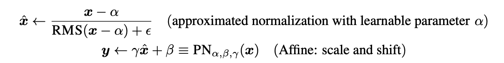

# [Official] Supernet Training for Federated Image Classification under System Heterogeneity

This repository is the official implementation of "Supernet Training for Federated Image Classification under System Heterogeneity".
- Paper, ICML 2022 Workshop: Dynamic Neural Networks, Oral Paper ([link](https://dynn-icml2022.github.io/papers/))
This repository contains the code to design the federated supernet training mentioned in the paper ([link](https://arxiv.org/abs/2206.01366)).


# Reference Codes

We refer to some official implementation codes

- https://github.com/facebookresearch/AttentiveNAS
- https://github.com/jhoon-oh/FedBABU
- https://github.com/pliang279/LG-FedAvg

# 💻 Overview

This paper proposes the federation of supernet training (FedSup) framework to tackle both data heterogeneity and system heterogeneity issues simultaneously, i.e., where clients send and receive a supernet that contains all possible architectures sampled from itself. The approach is inspired by observing that averaging parameters during model aggregation for FL is similar to weight-sharing in supernet training. Thus, the proposed FedSup framework combines a weightsharing approach widely used for training single shot models with FL averaging (FedAvg). Furthermore, we develop an efficient algorithm (E-FedSup) by sending the sub-model to clients on the broadcast stage to reduce communication costs and training overhead, including several strategies to enhance supernet training in
the FL environment. We verify the proposed approach with extensive empirical evaluations. The resulting framework also ensures data and model heterogeneity robustness on several standard benchmarks.


- (a) Standard FL: Despite the FL's popularity, significant issues remain regarding delivering compact models specialized for edge devices with widely diverse hardware platforms and efficiency constraints.
- (b) Standard Supernet Training: This approach has been rarely considered under data heterogeneity scenarios that can provoke the training instability.
- (c) FedSup: It uses weight sharing in supernet training to forward supernets to each local client and ensembles the sub-model training sampled from itself at each client.
- (d) E-FedSup: As an efficient version of FedSup, it broadcasts sub-models to local clients in lieu of full supernets.

# 🤔 Getting Started


## Requirements
- This codebase is written for `python3` (used `python 3.7.6` while implementing).
- To install necessary python packages, run `pip install -r requirements.txt`.


## ⚠️ Setup Local Package (IMPORTANT)

Register the project directory as a Python package to allow for absolute imports.

```bash
python3 setup.py develop
```


## Dataset
### CIFAR10, CIFAR100, PathMNIST, FashionMNIST
You don't have to take care about these dataset. Download options of these datasets are included in the codes.


# ⭐️ Supernet Training
We provide the neural network used in the paper, MobileNet style.

## 👊 Dynammic Neural Network with MobileNet Style
Search space details are presented by referring to the previous NAS and FL approaches (Cai et al., 2019; Oh et al., 2021). Our network architecture comprises a stack with MobileNet V1 blocks (Howard et al., 2017), and the detailed search space is summarized in Appendix. Arbitrary numbers of layers, channels, and kernel sizes can be sampled from the proposed network. Following previous settings (Yu et al., 2018; 2020), lower-index layers in each network stage are always kept. Both kernel size and channel numbers can be adjusted in a layer-wise manner.

You can handle the search space with the config file `./config/efficient_fedsup.yml`.
In this file, `supernet_config` presents the search space as follows:

```
supernet_config:
    resolutions: [32]
    first_conv: 
        c: [32]
        act_func: 'relu'
        s: 2
    mb1:
        c: [32,64]
        d: [1]
        k: [3,5,7]
        t: [1]
        s: 1
        act_func: 'relu'
        se: False
    mb2:
        c: [64,128]
        d: [1,2]
        k: [3,5,7]
        t: [1]
        s: 2
        act_func: 'relu'
        se: False
    mb3:
        c: [128,256] 
        d: [1,2]
        k: [3,5,7]
        t: [1]
        s: 2
        act_func: 'relu'
        se: False
    mb4:
        c: [512,1024] 
        d: [1,2]
        k: [3,5,7]
        t: [1]
        s: 2
        act_func: 'relu'
        se: False
```


## 🎓 Parametric Normalization


Although batch normalization (BN) is an ubiquitous technique for most recent deep learning approaches, its running statistics can disturb learning for the sub-model alignment in supernet optimization because different lengths of representations can have heterogeneous statistics, and hence their moving average diverges for a shared BN layer (Yu & Huang, 2019; Yu et al., 2018) (Figure (a)). Furthermore, it is well-known that these BN statistics can violate the data privacy in FL (Li et al., 2021c). To alleviate these issues, we develop new normalization technique, termed as parameteric normalization (PN), as follows:



where x is an input batch data, RMS is the root mean square operator, γ, β are learnable parameters used in general batch normalization techniques, and α is a learnable parameter for approximating batch mean and variance. The key difference between our PN and previous normalization techniques is the existence of batch statistics parameters. In the previous works (Yu et al., 2018; Diao et al., 2021), since the running statistics of batch normalization layers can not be accumulated during local training in FL owing to the violence of data privacy as well as different model size (Huang et al., 2021), running statistics are not tracked. An adhoc solution employs static batch normalization (Diao et al., 2021) for model heterogeneity in FL, with the running statistics updated as each test data is sequentially queried for evaluation (Figure (b)). However, operational performance is highly dependent on such query data and can be easily degraded by its running statistics. In contrast, the proposed PN method simply uses an RMS norm and learnable parameter α rather than batch-wise mean and variance statistics, and thus does not require any running statistics. Hence more robust architectures can be trained towards batch data (Figure (c)). In a nutshell, our PN methods not only eliminates privacy infringement concerns due to running statistics, but also enables slimmable normalization techniques robust towards query data.

Here is a snippet of the parametric normalization.

```
class PNorm(nn.Module):
    def __init__(self, d, p=-1., eps=1e-8, bias_switch=True):
        """
        Parametric Normalization
        :param d: model size
        :param p: partial PNorm, valid value [0, 1], default -1.0 (disabled)
        :param eps:  epsilon value, default 1e-8
        :param bias: whether use bias term for PNorm, disabled by
            default because PNorm doesn't enforce re-centering invariance.
        """
        super(PNorm, self).__init__()

        self.eps = eps
        self.d = d
        self.p = p
        self.bias_switch = bias_switch

        self.weight = nn.Parameter(torch.ones(d))
        self.register_parameter("weight", self.weight)

        if self.bias_switch:
            self.bias = nn.Parameter(torch.zeros(2, d))
            self.register_parameter("bias", self.bias)

    def forward(self, x, feature_dim=None):
        if feature_dim == None:
            feature_dim = self.d
        if self.p < 0. or self.p > 1.:
            norm_x = ((x  - self.bias[0,:feature_dim].unsqueeze(0).unsqueeze(2).unsqueeze(3))).norm(
                2, dim=(-4, -2,-1), keepdim=True)
            d_x = feature_dim
        else:
            partial_size = int(feature_dim * self.p)
            partial_x, _ = torch.split(x, [partial_size, feature_dim - partial_size], dim=(-2,-1))

            norm_x = partial_x.norm(2, dim=(-2,-1), keepdim=True)
            d_x = partial_size

        rms_x = norm_x * ((x.shape[0]* x.shape[-1]* x.shape[-2]) ** (-1/2))
        x_normed = (x-self.bias[0,:feature_dim].unsqueeze(0).unsqueeze(2).unsqueeze(3)) / (rms_x + self.eps)

        if self.bias_switch:
            return self.weight[:feature_dim].unsqueeze(0).unsqueeze(2).unsqueeze(3) * x_normed + self.bias[1,:feature_dim].unsqueeze(0).unsqueeze(2).unsqueeze(3)
        return self.weight[:feature_dim].unsqueeze(0).unsqueeze(2).unsqueeze(3) * x_normed

```


# 💻 Code Implementation

You can get the results of E-Fedsup with the following line:

I. Shard per users
```
python main.py --shard_per_user 10 --dataset cifar100 --label_smoothing 0.0 \
               --gpu 0 --frac 0.1 --local_ep 5 --momentum 0.9 \
               --inplace_distill False --num_arch_training 1 \
               --drop_connect 0.0 --dropout 0.0 --results_save "vanilla" \
               --diri "False" --config-file config/efficient_fedsup.yml
```

II. Dirichlet distribution
```
python main.py --beta 0.1 --dataset cifar100 --label_smoothing 0.0 \
               --gpu 0 --frac 0.1 --local_ep 5 --momentum 0.9 \
               --inplace_distill False --num_arch_training 1 \
               --drop_connect 0.0 --dropout 0.0 --results_save "vanilla" \
               --diri "True" --config-file config/efficient_fedsup.yml
```

## Script for running
For much easier implementation, refer to `./scripts` folder.


## Results
You can reproduce all results in the paper with our code. All results have been described in our paper including Appendix. The results of our experiments are so numerous that it is difficult to post everything here. However, if you experiment several times by modifying the hyperparameter value in the .sh file, you will be able to reproduce all of our analysis.

